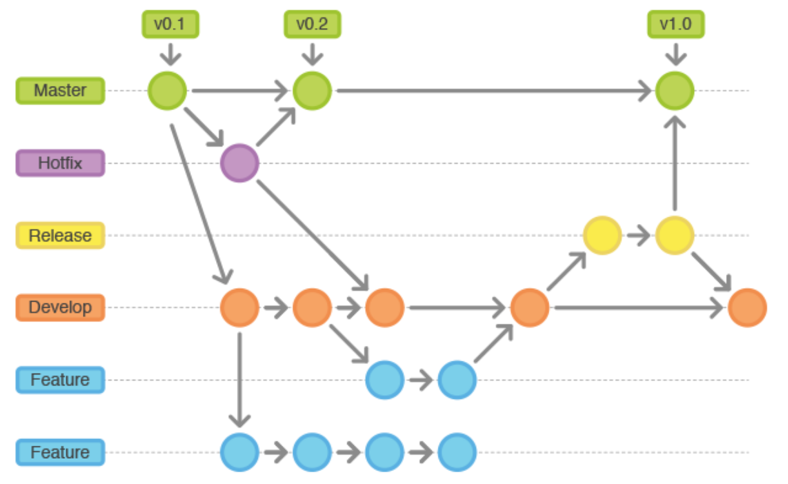

# Convenção de Código Nodejs

O objetivo desta página é fornecer um conjunto abrangente de diretrizes e recomendações para a formatação e escrita de código em JavaScript/Node. O propósito final é estabelecer um padrão que facilite a leitura e compreensão do código por desenvolvedores de diferentes níveis de experiência. Neste guia, você encontrará orientações claras e concisas, abordando as melhores práticas para garantir a consistência e qualidade do código produzido.

## Eslint

O ESLint é uma ferramenta de linting para JavaScript. Ele verifica o código em busca de possíveis erros, problemas de estilo e práticas recomendadas. No Node.js, o ESLint pode ser usado para garantir que o código JavaScript esteja livre de erros e siga as convenções de estilo definidas pela equipe ou pelo projeto. Isso ajuda a manter o código limpo, legível e consistente, facilitando a manutenção e colaboração entre os desenvolvedores.

Neste projeto, estamos usando o guia de estilo do
[Airbnb](https://www.npmjs.com/package/eslint-config-airbnb-base).

[Saiba mais sobre o  ESLint](https://eslint.org/)

## Prettier

O Prettier é uma ferramenta de formatação de código para várias linguagens de programação, incluindo JavaScript. Ele ajuda a manter um estilo consistente no código, formatando automaticamente o código-fonte de acordo com regras predefinidas. O objetivo principal do Prettier é eliminar debates sobre estilo de código entre os membros da equipe, tornando a formatação do código uma preocupação automática e eliminando a necessidade de configuração manual de estilos de código.

[Saiba mais sobre o Prettier](https://prettier.io/)

## Husky

O Husky é uma ferramenta que permite integrar ganchos (hooks) do Git em seu fluxo de trabalho de desenvolvimento. Com o Husky, você pode configurar facilmente a execução de scripts automatizados em determinados eventos do Git, como antes de fazer um commit (pre-commit) ou antes de fazer push (pre-push). Isso ajuda a garantir que determinadas ações, como execução de testes automatizados ou linting de código, sejam realizadas antes que as alterações sejam confirmadas ou enviadas para o repositório remoto. O Husky é comumente usado em conjunto com outras ferramentas, como ESLint e Prettier, para garantir a consistência e a qualidade do código em um projeto.

[Saiba mais sobre o Husky](https://typicode.github.io/husky/#/)

## Lint Staged

O lint-staged é uma ferramenta que permite executar linters em arquivos específicos no momento do commit. Ele funciona em conjunto com o Husky para rodar scripts somente em arquivos que estão sendo preparados para serem commitados. Isso permite que você execute linting apenas nos arquivos que serão commitados, em vez de em todo o código do projeto, o que pode economizar tempo de execução.

[Saiba mais sobre o Lint Staged](https://github.com/lint-staged/lint-staged)

## Commit Lint

O Commitlint é uma ferramenta que ajuda a manter a consistência nas mensagens de commit de um projeto. Ele define regras para o formato das mensagens de commit e verifica se as mensagens de commit seguem essas regras. Isso é útil para garantir que todas as mensagens de commit sejam descritivas, padronizadas e informativas, facilitando a compreensão do histórico de alterações do projeto.

Exemplo de commits:

```
{
  "types": [
    {"type": "chore", "section":"Others", "hidden": false},
    {"type": "revert", "section":"Reverts", "hidden": false},
    {"type": "feat", "section": "Features", "hidden": false},
    {"type": "fix", "section": "Bug Fixes", "hidden": false},
    {"type": "improvement", "section": "Feature Improvements", "hidden": false},
    {"type": "docs", "section":"Docs", "hidden": false},
    {"type": "style", "section":"Styling", "hidden": false},
    {"type": "refactor", "section":"Code Refactoring", "hidden": false},
    {"type": "perf", "section":"Performance Improvements", "hidden": false},
    {"type": "test", "section":"Tests", "hidden": false},
    {"type": "build", "section":"Build System", "hidden": false},
    {"type": "ci", "section":"CI", "hidden":false}
  ]
}
```

[Saiba mais sobre o Commit Lint](https://commitlint.js.org/)

## Commitizen

O Commitizen é uma ferramenta que facilita a criação de mensagens de commit padronizadas e descritivas. Ele fornece uma interface interativa para criar mensagens de commit seguindo um formato específico, geralmente baseado em convenções como o Conventional Commits. Isso ajuda a garantir que as mensagens de commit sejam consistentes e informativas, o que facilita a compreensão do histórico de alterações do projeto e o processo de revisão de código.

[Saiba mais sobre o Commitizen](https://commitlint.js.org/)

## Standard Version

O Standard Version é uma ferramenta que simplifica o processo de versionamento de projetos, automatizando a criação de versões e a geração de notas de lançamento (changelogs). Ele utiliza convenções de commits para determinar automaticamente o próximo número de versão com base nas alterações introduzidas desde a última versão. Isso ajuda a manter um histórico claro e organizado das alterações realizadas em cada versão do software.

[Saiba mais sobre o Standard Version](https://github.com/conventional-changelog/standard-version)

## Versionamento Semântico

O Versionamento Semântico, ou SemVer, é uma maneira padronizada de atribuir e incrementar números de versões a software, visando comunicar a natureza e o impacto das mudanças feitas.

Ele segue um formato de três partes: MAJOR.MINOR.PATCH, por exemplo: 2.0.1

- **MAJOR**: É incrementado quando existem mudanças incompatíveis com a versão anterior, indicando que o software sofreu alterações significativas que podem requerer ajustes para funcionar com versões anteriores.
- **MINOR**: Aumenta quando são adicionadas funcionalidades de forma compatível com as versões anteriores, sugerindo novas funcionalidades ou melhorias que mantêm a compatibilidade.
- **PATCH**: É elevado quando correções de bugs são implementadas de maneira compatível com a versão anterior, ou seja, ajustes menores que resolvem problemas sem introduzir novas funcionalidades ou comprometer funcionalidades existentes.

[Versionamento Semântico](https://github.com/conventional-changelog/standard-version)

## Git Flow

O Git Flow é um modelo de fluxo de trabalho para o Git que define uma estrutura para colaboração e gerenciamento de código-fonte em projetos de software. Ele propõe uma ramificação de código consistente, com branches específicos para diferentes tipos de atividades, como desenvolvimento de novas funcionalidades, correção de bugs e lançamento de versões estáveis. O Git Flow define uma série de boas práticas e convenções para o uso de branches e merge, o que ajuda a manter o código organizado e facilita o trabalho em equipe.



[Saiba mais sobre o Gitflow](https://www.atlassian.com/br/git/tutorials/comparing-workflows/gitflow-workflow)

## S.O.L.I.D  

SOLID são cinco princípios da programação orientada a objetos que facilitam no desenvolvimento de softwares, tornando-os fáceis de manter e estender. Esses princípios podem ser aplicados a qualquer linguagem de POO.

- SRP — Single Responsibility Principle: Princípio da Responsabilidade Única — Uma classe deve ter um, e somente um, motivo para mudar;
- OCP — Open-Closed Principle: Princípio Aberto-Fechado — Objetos ou entidades devem estar abertos para extensão, mas fechados para modificação, ou seja, quando novos comportamentos e recursos precisam ser adicionados no software, devemos estender e não alterar o código fonte original;
- LSP— Liskov Substitution Principle: Princípio da substituição de Liskov — Uma classe derivada deve ser substituível por sua classe base;
- ISP — Interface Segregation Principle: Princípio da Segregação da Interface — Uma classe não deve ser forçada a implementar interfaces e métodos que não irão utilizar;
- DIP — Dependency Inversion Principle: Princípio da Inversão de Dependência — Dependa de abstrações e não de implementações.

[Saiba mais sobre o SOLID?](https://medium.com/desenvolvendo-com-paixao/o-que-%C3%A9-solid-o-guia-completo-para-voc%C3%AA-entender-os-5-princ%C3%ADpios-da-poo-2b937b3fc530) |
[Youtube](https://www.youtube.com/watch?v=mkx0CdWiPRA)

----

## Clean Code  

Clean Code é uma filosofia de desenvolvimento cuja o principal objetivo é aplicar técnicas simples que visam facilitar a escrita e leitura de um código.

Regras Básicas:

- Nomes são importantes: é importante definir um nome claro e objetivo para o seu código, seja ele uma variável, uma classe, um método, uma função ou um parâmetro. E não se preocupe se o nome for muito grande, desde que ele seja necessário;
- Regra do escoteiro: ou seja, deixe tudo mais limpo do que encontrou. Isso quer dizer que você deve deixar o código mais limpo do que quando começou a sua manutenção;
- Seja o autor do código: entenda o código como uma história a ser contada. E para ela ser perfeitamente entendida, é importante que ela tenha funções simples e pequenas, ou seja, as menores possíveis;
- Não repita a si mesmo (Don’t repeat yourself): esse conceito, abordado no livro The Pragmatic Programmer (de David Thomas e Andrew Hunt) mostra que não deve haver duas partes do software exercendo a mesma função;
- Comente somente o necessário: se for para comentar, que o desenvolvedor se restrinja ao necessário, pois como os códigos são modificados e os comentários não, pode haver problemas futuros com os comentários já realizados;
- Tratamento de erros: quando as coisas derem errado, a pessoa desenvolvedora precisa continuar garantindo que o código fará o que precisa. Nesse sentido, é importante tratar o erro para evitar maiores transtornos;
- Testes limpos: um código é considerado limpo após os testes. Por essa razão, os testes também devem ser limpos, ou seja, executados da melhor maneira possível por qualquer pessoa da equipe.

# Recomentações

### Evitar o uso de bibliotecas de terceiros

 Recomendado:

```javascript
const date = new Date('2024-03-20');
const formattedDate = new Intl.DateTimeFormat('pt-BR').format(date);

console.log(formattedDate); // Saída: "20/03/2024"

```

[Documentação do Intl.](
https://developer.mozilla.org/pt-BR/docs/Web/JavaScript/Reference/Global_Objects/Intl)

 Não recomentado:

```javascript
import moment from 'moment';
import 'moment/locale/pt-br';
moment.locale('pt-br');

const date = moment('2024-03-20');
const formattedDate = date.format('DD/MM/YYYY');

console.log(formattedDate); // Saída: "20/03/2024"


```

### Criar componentes agnóticos

```javascript
// src/services/HttpServiceExample.js
import axios from 'axios';
import { HttpsProxyAgent } from 'https-proxy-agent';

export async function request(originalConfig) {
  const config = { ...originalConfig };
  const usaProxy = process.env.NODE_ENV === 'local';

  if (usaProxy) {
    const proxyOptions = {
      host: process.env.PROXY_HOST,
      port: process.env.PROXY_PORT,
    };

    const proxyAgent = new HttpsProxyAgent(proxyOptions);
    config.httpsAgent = proxyAgent;
  }

  const response = await axios(config);
  return response;
}

```  

```javascript
 // src/services/GetListExample.js
import { request } from './httpService';
 

export const getList = async () => {
  try {
    const config = {
      url: 'URL_DA_API_EXTERNA',
      method: 'GET',
      json: true,
    };

    const { data } = await request(config);
    return data;
  } catch (error) { 
    throw error;
  }
};

```

### Estrutura de pastas

```
src
├── configs
├── controllers
├── databases
├── helpers 
├── models
├── repositories
├── routers
├── services
└── utils

```

### Nomenclatura de projeto

 1. camelCase para variáveis:

 ```javascript
  const userName = 'Robson Rabelo';
  ```

 2. PascalCase para classes e nome de arquivos:

```javascript
// src/services/UserService.js
export class UserService {
  constructor() {
    this.userRepository = new UserRepository();
  }
  // implementação
}
```

3. UPPER_SNAKE_CASE para constantes com valores fixos:

```javascript
const USER_NOT_FOUND = 'O usuário não foi encontrando em nossa base de dados';
```

4. kebab-case para nomes de diretórios

```javascript
src/external-service
```

### Estrutura de testes(jest)

Manter o arquivo `*.spec.js` junto da funcionalidade:

```javascript
src 
└── services
    ├── UserService.js
    └── UserService.spec.js
```
# convencao-de-codigo-javascript
